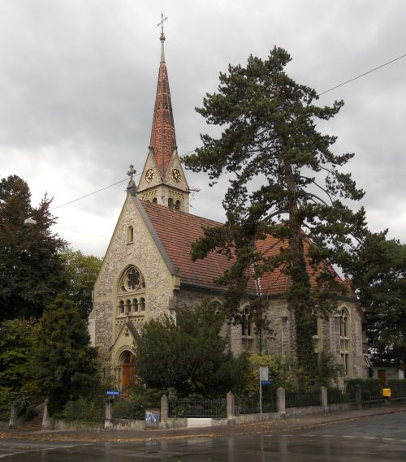
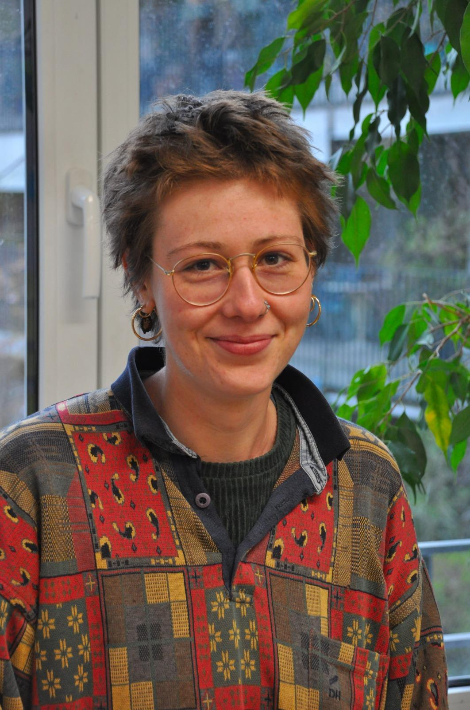
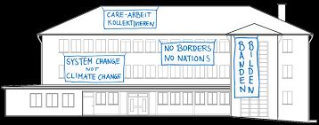

+++
title = "Haus der Bewegungen"
date = "2024-06-14"
draft = false
pinned = false
image = "johanneskirche.jpg"
description = "Ein Ort, der uns zeigt, dass ein solidarisches Zusammenleben möglich ist."
+++
Menschen, die nur schwarz und weiß sehen, sehen die Schönheit des Regebogens nicht.

Hannah Elias und ihr Team arbeiten an einem Projekt, das sogenannte "Haus der Bewegung". Das Haus der Bewegung ist ein Verein, der sich damit beschäftigt, einen physischen Raum zu schaffen, wo Aktivist*innen aus verschiedenen sozialen Bewegungen sich begegnen und politische Diskussionen und Meinungs- und Ideenaustausche stattfinden können.

Dieser Verein plant eine Umnutzung des Kirchgemeindehauses der Johanneskirche in Bern. Jedoch gibt es das Haus noch nicht. Die Diskussionen können erst dann gehalten werden, wenn das sie Haus kaufen. Ihre Gruppe kontaktiert mit über 60 Gruppen, vor allem feministische, antirassistische, Klimagruppen, und weitere Gruppen.

Das Interview wurde in der Nacht des 25 Februars 2024 durchgeführt. Sie lässt ihr Velo neben ihrem Laden, wo das Interview stattgefunden hat. Der Geruch der Waren ist ziemlich intensiv. Das Licht ist bequem, nicht sehr blendend, in einer warmen, nostalgischen Farbe. Eine Maschine (ich weiß nicht genau wofür sie war) füllt den Raum mit ihrem Geräusch.

Das Interview fängt an. Ich atme tief durch und lasse mich so beginnen: "Was sind Ihre alltägliche Tätigkeiten im Haus der Bewegung?"

"Wir führen Gespräche mit Verhandlungen für das Haus und überlegen, wer alles in dieses Haus hinein möchte. Wir haben mit all diesen Gruppen Kontakt und Öffentlichkeitsarbeit. Wir schreiben auch viele Texte und haben sehr viele Sitzungen."

Ihr Sprechtempo und Lautstärke sind sehr angenehm und sie strahlt eine positive Energie. Durch Ihre Art und Weise des Sprechens ist es erkennbar, dass sie alltäglich nur Hochdeutsch spricht. Ich schaue sie neugierig an, während ich mich für eine etwas mehr herausfordernde, kühne Frage vorbereite. "Was hat Sie in Ihrem Leben motiviert, für die Inklusion der unterschiedlichen Menschengruppen beizutragen?".

Hannah Elias sieht überrascht aus. Sie schaut nach oben und ein Lächeln ist ausdrücklich in ihrem Gesicht. Sie antwortet nach einer Zeit von Nachdenken: "Für mich war es immer ein Thema, Gerechtigkeit zu sehen..." Plötzlich unterbricht sie sich selbst und lacht: "Nein, wir löschen diese Antwort." Jetzt lachen wir beide. Das war die humorvolle Kulmination des Interviews. Die Antwort fand ich schön, aber vielleicht wollte sie eine konkretere Antwort für diese von ihr «gute, schwere Frage» genannte Frage geben.

> *"Ich habe an vielen unterschiedlichen Orten gelebt und viele Menschen dadurch kennengelernt. Dadurch habe ich auch gesehen, welche unterschiedlichen Alltagsrealitäten es gibt auf der Welt, und dass es viele Ungerechtigkeiten gibt, die sehr tief in unserem Alltag verankert sind. Ich fand es immer schwer, dann in meinen Alltag zurückzukommen und zu denken, dass es abgeschlossen ist, dass es ein eigener Teil ist, der unabhängig existiert, weil ich gesehen habe, wie wir alle zusammenhängen."*
>
> Hannah Elias

Ich finde ihren Einsatz sehr inspirierend und faszinierend. Obwohl sie selbst nicht von den Ungerechtigkeiten, die sie erwähnt hat, betroffen ist, sie versucht es aktiv, für die betroffenen Menschen beizutragen. Nicht jeder Mensch besitzt diese Stärke. In der Umgebung meines Heimatlandes, Nordmazedonien, hatten Menschen eine negative Haltung gegenüber Minderheiten. Doch wollte ich auch wissen, wie sie es in der Schweiz empfindet, ob sie einen guten Bild von ihr hat.

"Denken Sie, dass die Schweiz verglichen mit den östlicheren Ländern gegenüber der Frauenrechten und die Homosexuellen Menschen wirklich so liberal ist, wie sie oft dargestellt wird?" In diesem Moment hört das Geräusch der Maschine.

Hannah Elias versteht sofort, welcher Zusammenhang die Frage mit dem Thema hat. Sie schien verneinend zu sein, was ein Vorzeichen für die Antwort war. "Im Vergleich zu Saudi-Arabien, die Schweiz macht bestimmt viel über die Rechte der Frauen und der Homosexuellen Menschen. Aber es braucht noch mehr." Sie regt sich ein bisschen auf, wechselt zu einem überzeugenderer Ton. "Es ist noch nicht genug verstanden, warum manche Sachen problematisch sind und in welcher Tiefe Themen besprochen werden müssen."

Sie macht einen validen Punkt hier. Wenn ein Mensch kein Opfer mancher Problemen ist, ist er/sie von der Natur nicht genug dafür interessiert, die Betroffenen zu vertreten, indem er/sie sich in ihrer Stelle setzt, nur um beliebt zu bleiben.

In diesem Augenblick entscheide ich mich, langsam das Interview zum Ende zu bringen: "Und was ist Ihr Moto, ihre Vision?"

Sie öffnet ihre Augen weiter, sieht beeindruckt und stolz aus. "Ein Haus, wo Menschen miteinander sind und wirken, wo sie für sich gegenseitig emotional dabei sind, ohne dass jemand eine Machtposition besitzt."

Die Johanneskirche in der Nähe klingt. Die Atmosphäre der Nacht ist etwas düster. Wir stehen auf und ich verlasse den Laden. Draußen ist es viel kälter als im Laden. Obwohl ich schon vor diesem Interview ihre Sicht stark unterstützte, jetzt verstehe ich es noch besser, wie eine Gemeinschaft, wo jeder Mensch gleich zählt, Herausforderungen viel effektiver überwältigt.

Ich bedanke mich ganz herzlich zu Hannah Elias für ihre Teilnahme und ihr Mitmachen. Ich wünsche ihr einen Riesenerflog in ihrem Projekt, und hoffe, dass ihr Team sogar ein noch größerer Schritt für eine solidarische Gesellschaft schaffen wird als alle jetzt erwarten.